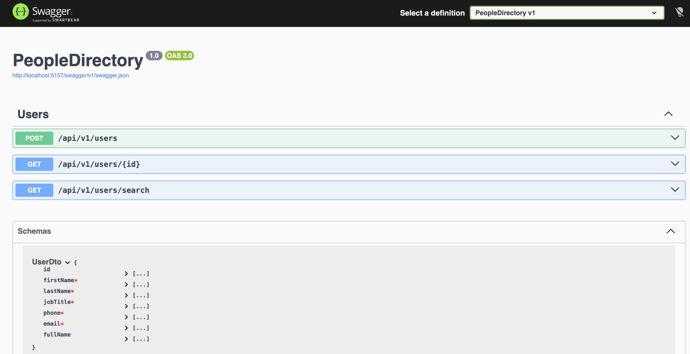

# People Directory API
A .NET Web API providing user directory management.The frontend Angular repository can be found [here](https://github.com/pchristou/people-directory).

## Architecture
The project follows a decoupled layered architecture:

Controllers: Handle HTTP requests and routing.

Repositories: Contain business logic and data orchestration.

Infrastructure: Abstraction layer (IFileWrapper) to handle persistent storage.

## Data Persistence

The "database" is a local `users.json` file.

Production Note: This is a lightweight implementation for demo purposes. In a production environment, this would be swapped for a SQL or NoSQL provider by implementing a new Repository.

Seeding: On startup, the API resets users.json using users.seed.json to ensure a consistent state for demos and development.

##  Testing

Includes a separate xUnit test suite. To ensure the logic remains testable without physical disk I/O, the file system is abstracted behind an IFileWrapper interface. This allows for efficient unit testing using Moq and xUnit by simulating file states in memory.

Unit Tests: Focus on the UserRepository logic (ID generation, duplicate email validation, and search filtering).

Mocking: Uses Moq to isolate business logic from the file system.

Assertions: Uses FluentAssertions for readable, human-centric test code.
